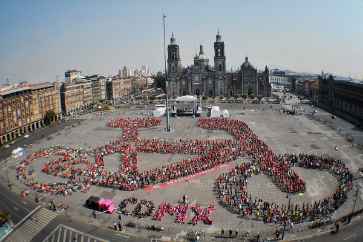

# Sacbé

##Contexto

En la Ciudad de México, donde hay poco más de dos millones de carros circulan a diario poco más de un millón, con un transporte público colapsado y carísimo, la bicicleta es el transporte más barato y el que se desplaza a mayor velocidad en horas pico.

La mitad de los viajes en bicicleta en esta urbe son de menos de 8 kilómetros y duran menos de 20 minutos, y, en promedio, la bicicleta se usa entre 25 y 35 minutos.

En cuanto al clima, es propicio para el transporte en bicicleta: en época de calor, la temperatura no sobrepasa los 31 ó 32 grados centígrados; y, en época de frío, los días con menos de 11 grados centígrados no son muchos.

Y aunque la lluvia hace que disminuya el número de viajes en bicicleta, es predecible: en verano empieza a llover en la tarde. Así pues, quienes salen en bicicleta en la mañana, regresan a su casa un poco tarde, después de que la lluvia ya pasó.

Además, la mayor actividad laboral de la Ciudad de México (85%) se desarrolla en zonas sin altas pendientes.

Actualmente, del total de la movilidad vial en la Ciudad de México, el transporte en bicicleta representa 2.5% (poco menos de 300 mil viajes); hace 10 años representaba 1% (98 mil viajes). Con la duplicación de la infraestructura vial ciclista y una adecuada promoción se espera que los viajes en bicicleta se dupliquen en 2024.

La bicicleta es una opción viable, eficiente, de bajo costo y rápida en distancias cortas, que contribuye a mejorar la movilidad y a hacer de las ciudades espacios sustentables.

La disminución del uso del automóvil y del transporte público por el uso de la bicicleta (especialmente en viajes intermedios para ir a comer, hacer trámites…) tiene un efecto positivo sobre el medio ambiente. Y en la Ciudad de México, buena parte de los viajes se pueden hacer en bicicleta

##Problema

Según el recuento no oficial realizado por grupos de activistas, en 2018 fallecieron 18 ciclistas en la CDMX por accidentes de tránsito.

Comúnmente tendemos a creer la idea, equivocada, de que los automóviles son la principal amenaza para las personas que usan la bicicleta para transportarse en grandes ciudades. La mala calidad del pavimento, los baches, las alcantarillas abiertas, grietas, las inundaciones y los topes mal hechos, son un riesgo constante para ellos.

##User Persona

## Definición del producto

Los usuarios de Sacbé son personas que disfrutan de la movilidad que les da una bicicleta, pero que también quieren crear vínculos con otros ciclistas, crear comunidad para poder compartir información que les permita llegar a su destino de una manera rápida y segura.

La solución que proponemos para los ciclistas es: Sacbé. Sacbé es un camino recto, elevado, sin desniveles y pavimentado construido por los mayas prehispánicos.

Sacbé una Red Social para el ciclista que busca mantenerse conectado, crear vínculos con otros ciclistas, mantenerse informado de eventos, rodadas, bloqueos, inundaciones, baches, etc...Y que además le permite solicitar ayuda de otros miembros de la comunidad en caso de algún incidente.

## Prototipo de baja fidelidad

Construimos un primer  de baja fidelidad en MarvelApp.

Los comentarios que obtuvimos acerca de este fueron:

-Necesitabamos diferenciar claramente las pantallas de "Iniciar sesión" y "Crear cuenta"
-No se entendía a que se refería la sección "Directorio"
-No se identificaba fácilmente el botón de agregar publicación en la primera ubicación que lo pusimos.

En consecuencia, decidimos dividir el directorio en dos secciones "Talleres" y "Tiendas" que eran más explicitas. De igual manera, decidimos cambiar la ubicación del botón de "Agreegar publicación" y mostrar dicho botón en el timeline

## Prototipo de alta fidelidad

Tomando en cuenta el feedback anterior, construimos un  de alta fidelidad en Figma.

Los comentarios que obtuvimos sobre este prototipo, fueron en general que era bastante intuitiva. Algunas observaciones fueron acerca de:
-No se intuía en todos los casos que la foto del usuario en la sección superior izquierda desplegaba un menú lateral.
-No resultaba intuitivo el botón de SOS, muchos los confundieron con notificaciones. Además no entendían cual era su función.

## Historias de Usuario

Como usuario nuevo debo poder crear una cuenta con email y password para poder iniciar sesion. Por otro lado, necesito también tener la opción de iniciar sesión con mi cuenta de Google o Facebook.
  **Criterios de aceptación**
- Si el mail o password no es válido, al momento de logearme, debo poder ver un mensaje de error.
- Debe ser visible si hay algún mensaje de error.
- Debo poder ver esta página de creación en Móviles y desktop (responsive).
- No debe necesitar recargar la página para crear una cuenta (SPA).
  **Definición de terminado**
- La funcionalidad cumple/satisface los criterios de aceptación.
- La funcionalidad tiene test unitarios.
- El diseño visual corresponde al prototipo de alta fidelidad.
- El código de esta funcionalidad recibió code review.
- La funcionalidad esta desplegada y pública para ser probada.
- La funcionalidad fue probada manualmente.
- Se hicieron pruebas de usuabilidad y se implementó el feedback si se consideró necesario.

Como usuario, una vez que ya ingrese con mi cuenta, quiero poder crear una publicación para invitar a los otros ciclistas a una rodada
  **Criterios de aceptación**
  **Definición de terminado**

Como usuario quiero poder editar una publicación, ya que me equivoqué al publicar la hora de la rodada y quiero corregir la hora.
  **Criterios de aceptación**
  **Definición de terminado**

Como usuario, quiero poder eliminar una publicación que hice porque me di cuenta que el evento que compartí ya pasó.
  **Criterios de aceptación**
  **Definición de terminado**

Como usuario quiero poder darle like a una publicación de un evento que me gustó.
  **Criterios de aceptación**
  **Definición de terminado**

